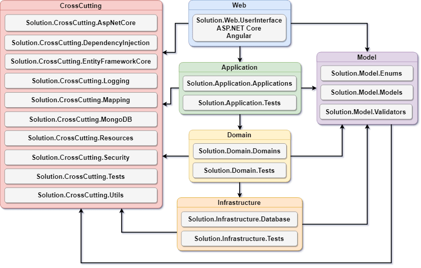
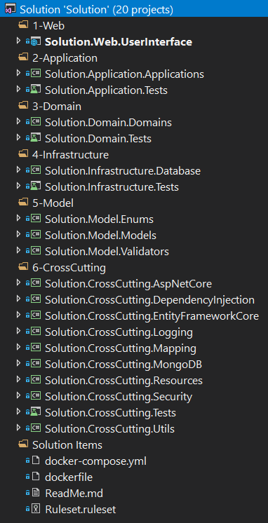
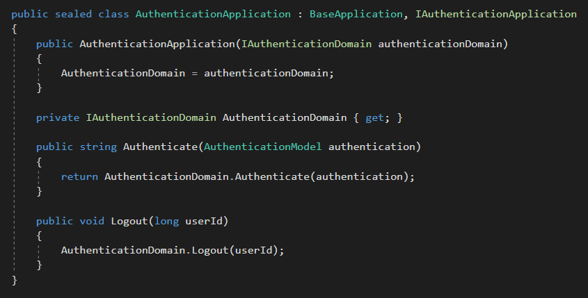
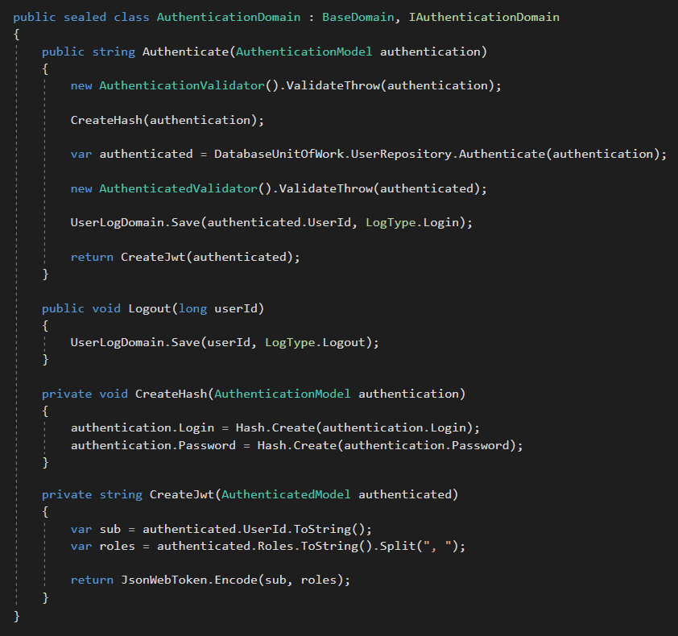
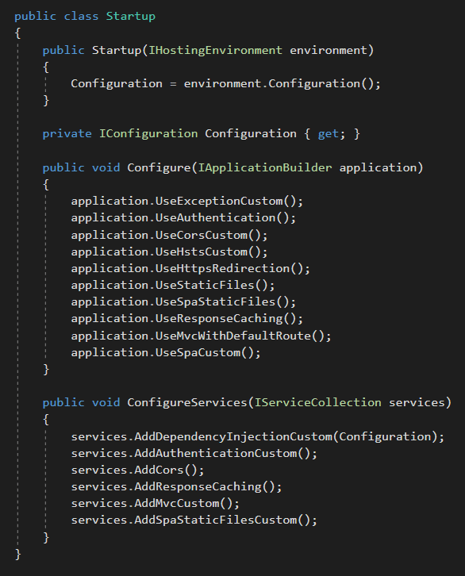
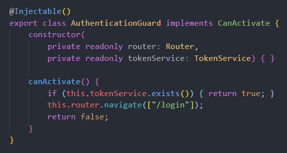
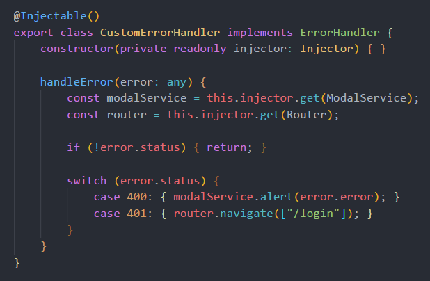
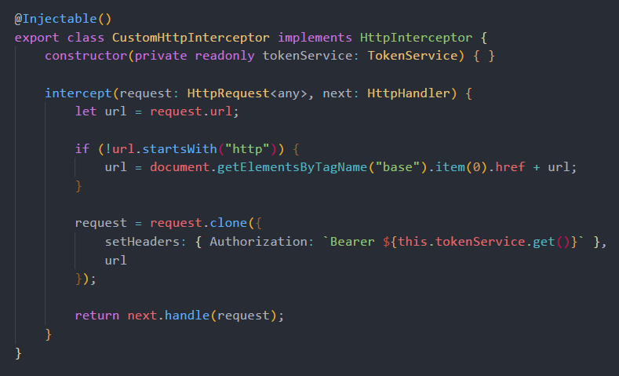

# DotNetArchitecture

Solution to apply and share new knowledge and technologies and to serve as architecture for new projects.

## Tools, Practices and Technologies

* Cross-Platform (Windows, Linux, macOS)
* Docker
* Visual Studio 2017
* Visual Studio Code
* .NET Core 2.1.1
* ASP.NET Core 2.1.1
* Entity Framework Core 2.1.2
* SQL Server 2017
* MongoDB
* C# 7.3
* SPA (Single Page Application)
* Angular 6.1.6
* Typescript 2.9.2
* HTML5
* CSS3
* SASS (Syntactically Awesome Style Sheets)
* DDD (Domain-Driven Design)
* SOLID Principles
* Dependency Injection
* Unit Test
* JWT (Json Web Token)
* Code Analysis (Ruleset for C# and TSLint for Typescript)

## Build

## Code Analysis

## Layers

**Web:** This layer contains the user interface, responsible for interaction with the user to obtain and display data.

**Application:** This layer is the main entry point of the application.

**Domain:** This layer contains the requirements and the business logic, it is the core of the application.

**Infrastructure:** This layer isolates and abstracts the logic required for data persistence.

**Model:** This layer is responsible for modeling the domain classes according with the business context.

**CrossCutting:** This layer provides generic features for the other layers.

**Tests:** It is responsible for testing individual units of the code.

## Projects

## Application

## Domain

## Repository

## Unit Test

## ASP.NET Core + Angular

## ASP.NET Core Startup

## ASP.NET Core Controller

## Angular Guard

## Angular Error Handler

## Angular HTTP Interceptor

## Angular Service

## Angular Component

## ASP.NET Core + Angular + Entity Framework Core + SQL Server Performance

**Specifications:**

**Processor:** Intel Core I7 8700K Coffee Lake 8th-generation.

**Memory:** 16GB 2400Mhz DDR4.

**Storage:** Samsung Evo 960 SSD M2 250gb.

**OS:** Windows 10 Pro 64 bits.

**Web Server:** Kestrel.

**Database:** SQL Server 2017 Developer Edition.

## Run Visual Studio Code

1. Install [.NET Core SDK](https://aka.ms/dotnet-download).

2. Install [C# Extension](https://marketplace.visualstudio.com/items?itemName=ms-vscode.csharp).

3. Open **solution folder**.

4. Press **F5**.

## Run Docker

1. Execute **docker-compose up --build -d --force-recreate** in solution folder.

2. Open <http://localhost:8080>.

## Run Command Line

1. Install [.NET Core SDK](https://aka.ms/dotnet-download).

2. Open folder **Web\UserInterface\ClientApp** in command line.

3. Execute **npm run restore**.

4. Open folder **Web\UserInterface** in command line.

5. Execute **dotnet run**.

6. Open <https://localhost:8095>.

## Host and Deploy

[Microsoft host and deploy ASP.NET Core](https://docs.microsoft.com/en-us/aspnet/core/host-and-deploy/index?view=aspnetcore-2.1&tabs=aspnetcore2x)

## Visual Studio Extensions

[CodeMaid](https://marketplace.visualstudio.com/items?itemName=SteveCadwallader.CodeMaid)

[Roslynator](https://marketplace.visualstudio.com/items?itemName=josefpihrt.Roslynator2017)

[SonarLint](https://marketplace.visualstudio.com/items?itemName=SonarSource.SonarLintforVisualStudio2017)

[TSLint](https://marketplace.visualstudio.com/items?itemName=vladeck.TSLint)
